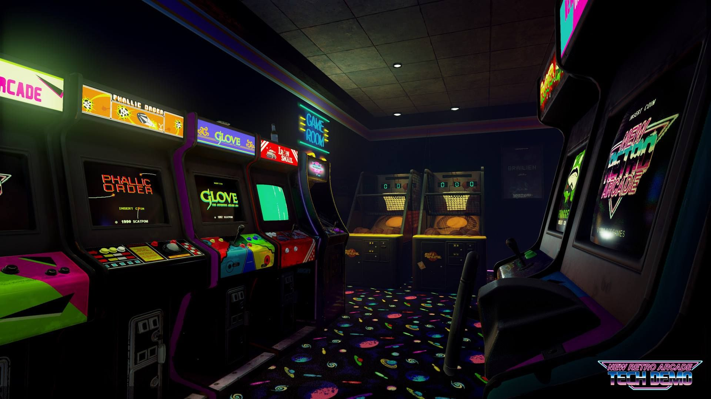

# OOP_arcade_2019



## Compilation

```bash
make
```

## Screenshot


## Contributors

This project has been made with :
- Erwan Sinou
- Julien Rondin

## Skills

- Paradigm shift : turning-in projects without non-justified C code (excluding libc, C-style casts)
- Modularization : use of class to separate the projects into several parts that are LOGICAL and COHERENT.
- Abstraction and generic programming : use of polymorphism through inheritance in order to factorize common code and for more genericity.
 

